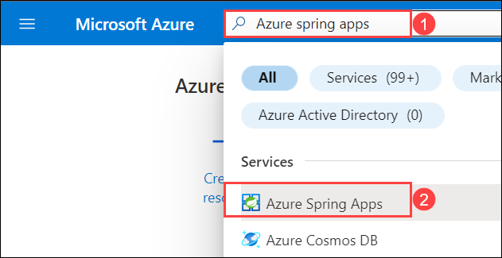
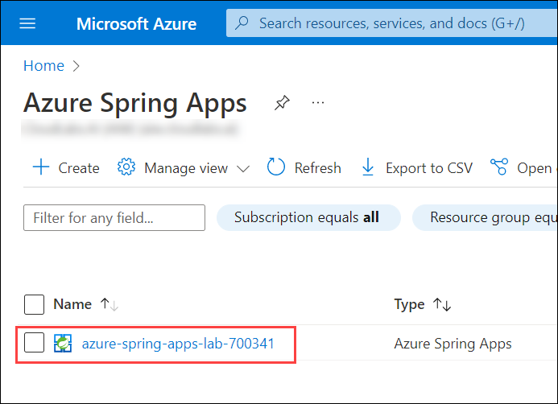
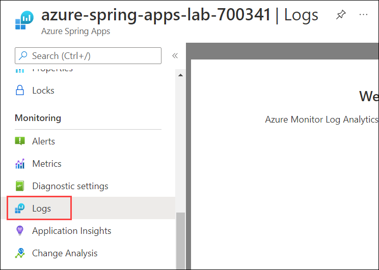

# Exercise 5 - Build a Spring Boot microservice using Spring Apps features

In this exercise, we'll build a similar service to the one from exercise 2, but with the addition of two important Spring Apps features. First, we'll add this service to Spring Apps registry for discovery by other services. Second, we'll use Spring Cloud Config to inject a setting from a Git repository into the application and display it on the screen.

---

## What we are going to build

1. We are going to build again a simple Spring Boot microservice like in exercise 2, but this time it will use two major Spring Apps features:

2. It will be connected to a Spring Apps Service Registry so it can discover other microservices, as well as being discovered itself!

3. It will get its configuration from the Spring Apps Config server that we configured in exercise 4.

4. For both features, it will just be a matter of adding an official Spring Boot starter, and Azure Spring Apps will take care of everything else.

## Task 1 : Create a simple Spring Apps microservice

1.  Open Git bash from the start menu if not already opened.

    
    
2. Login to your Azure account by using the following command:


 ```bash
 az login # Sign into an azure account
 az account show # See the currently signed-in account
 ```

3. To create our microservice, we will invoke the Spring Initalizer service from the command line:

  ```bash
  curl https://start.spring.io/starter.tgz -d dependencies=web,cloud-eureka,cloud-config-client -d baseDir=spring-cloud-microservice -d bootVersion=2.7.0 -d javaVersion=17 | tar -xzvf -
  ```

> This time, we add the `Eureka Discovery Client` and the `Config Client` Spring Boot starters, which will respectively automatically trigger the use of Spring Apps Service Registry and the Spring Apps Config Server.

## Task 2 : Add a new Spring MVC Controller

1. Now minimize the **Git Bash** window and navigate to the path `C:\Users\demouser\spring-cloud-microservice\src\main\java\com\example\demo`in **File Explorer**

   

2. Open a notepad, then paste the below code in a new file:

```java
package com.example.demo;

import org.springframework.beans.factory.annotation.Value;
import org.springframework.web.bind.annotation.GetMapping;
import org.springframework.web.bind.annotation.RestController;

@RestController
public class HelloController {

    @Value("${application.message:Not configured by a Spring Cloud Server}")
    private String message;

    @GetMapping("/hello")
    public String hello() {
        return message + '\n';
    }
}
```
3. Save the file next to `DemoApplication.java` in the `C:\Users\demouser\spring-cloud-microservice\src\main\java\com\example\demo` as `HelloController.java` by changing the **save as type** to all files and then **save** as shown below.

   
   
4. Navigate to the path `C:\Users\demouser\spring-cloud-microservice\src\main\resources\application.properties` and add the following line then save the file.

```java
spring.config.import=optional:configserver:
```

## Task 3 : Test the project locally

1. Run the below command in **Git Bash** before deploying the microservice to Azure Spring Cloud.

     ```bash
     cd spring-cloud-microservice
     ./mvnw spring-boot:run &
     cd ..
     ```
     
    >💡 Do not be alarmed when you see exception stack traces:
    > 
    >Spring Cloud is attempting to contact a local configuration server, which we have not provided. The application will still start using any available local settings and defaults.
    > When you receive above warining, you can press enter to make the process run in backgorund and proceed to next steps to access the endpoint. This is beacuse control will be checking for the available port to host the endpoint.

1. Requesting the `/hello` endpoint should return the "Not configured by a Spring Cloud Server" message.

     ```bash
     curl http://127.0.0.1:8080/hello
     ```
    

1. Kill the locally running microservice:

   ```bash
   kill %1
   ```

## Task 4 : Create and deploy the application on Azure Spring Apps

1. As in exercise 2, you create a specific `spring-cloud-microservice` application in your Azure Spring Apps instance by running the below command in **Git Bash**

    >**Note**: Replace the DID with **<inject key="DeploymentID" enableCopy="True"/>** value, you can also find it from Environment details page.

      ```bash
      az spring app create -n spring-cloud-microservice -s azure-spring-apps-lab-DID --runtime-version Java_17
      ```
 

2. Run the below command to build your "spring-cloud-microservice" project and send it to Azure Spring Apps:

    ```bash
    cd spring-cloud-microservice
    ./mvnw clean package -DskipTests
    az spring app deploy -n spring-cloud-microservice -s azure-spring-apps-lab-DID --jar-path target/demo-0.0.1-SNAPSHOT.jar
    cd ..
   ```
   
   >**Note**: Replace the DID with **<inject key="DeploymentID" enableCopy="True"/>** value, you can also find it from Environment details page.


## Task 5 : Test the project in the cloud

1. Navigate back to Azure Portal.

2. From the resource group **spring-apps-workshop-<inject key="DeploymentID" enableCopy="false"/>**. Select the Azure Spring Apps instance named **azure-spring-apps-lab-<inject key="DeploymentID" enableCopy="false"/>**.

   

3. Click on the **Apps** link under **Settings** on the navigation sidebar.

   

4. Verify that `spring-cloud-microservice` has a `Registration status` of `1/1`. This shows that it is correctly registered in Spring Cloud Service Registry.

   

5. Select `spring-cloud-microservice` to have more information on the microservice.

6. Click on 'See more' to see **Test Endpoint**

7. Copy the **Test Endpoint** that is provided.

8. Append `hello/` to the URL.  Failure to do this will result in a **404 not found**.

   

9. You can now use CURL again to test the `/hello` endpoint, this time it is served by Azure Spring Apps and configured using the Spring Config Server from exercise 4.

10. As a result, requesting the `/hello` endpoint should return the message that we configured in the `application.yml` file, coming from the Spring Cloud Config Server:

    ```bash
    Configured by Spring Cloud Config Server
    ```
11. If successful, you should see the message: `Configured by Spring Cloud Config Server`.

    

## Task 6 : Stream application logs

1. When you run an application on your machine, you can see its output in the console. When you run a microservice on Azure Spring Apps, you can also see its console output through Azure CLI:

   ```bash
   az spring app logs --name spring-cloud-microservice -f
   ```

> **Note**: Please be aware it might take a couple of minutes for the logs to show up.

2. You should see the console output of `spring-cloud-microservice` scroll by on your terminal:

   

 >**Note**: If you do not see the application logs appear, press CTRL+C to stop the stream. The logs should be visible now, scroll up to view the logs.

3. Press **CTRL+C** to stop following the output and return to the shell.

## Task 7 : Query application logs

Streaming the console output as we just did may be helpful in understanding the immediate state of a microservice. However, sometimes it's necessary to look further into the past or to look for something specific. This is easily done with Log Analytics. In exercise 3, we enabled log aggregation in Azure Log Analytics. Such settings changes can take 1-2 minutes to apply, so by now, you should be able to query Azure Log Analytics.

1. In the Azure Portal, search for **Azure Spring Apps** in the search box and select it. 

   

2. Now click on **azure-spring-cloud-lab-<inject key="DeploymentID" enableCopy="false"/>** resource from the list.

   

3. In the **Azure Spring Apps** resource pane, click on **Logs** under **Monitoring**. This is a shortcut to the Log Analytics workspace that was created earlier. If a tutorial appears, feel free to skip it for now.

   

4. This workspace allows you to run queries on the aggregated logs. The most common query is to get the latest log from a specific application:

   __Important:__ Spring Boot applications logs have a dedicated `AppPlatformLogsforSpring` type.

5. Here is how to get its 50 most recent logs of the `AppPlatformLogsforSpring` type for the microservice we just deployed:

6. Close other pop-up windows within the Logs and insert the below text in the text area that states "Type your queries here or click on of the example queries to start".  Click the text of the query, then click **Run**.

  ```sql
  AppPlatformLogsforSpring
  | where AppName == "spring-cloud-microservice"
  | project TimeGenerated, Log
  | order by TimeGenerated desc
  | limit 50
  ```

  

>💡 It can also take 1-2 minutes for the console output of an Azure Spring Apps microservice to be read into Log Analytics.

## Conclusion

Congratulations, you have deployed a complete Spring Apps microservice, using Spring Apps Service Registry and Spring Apps Config Server!

---
