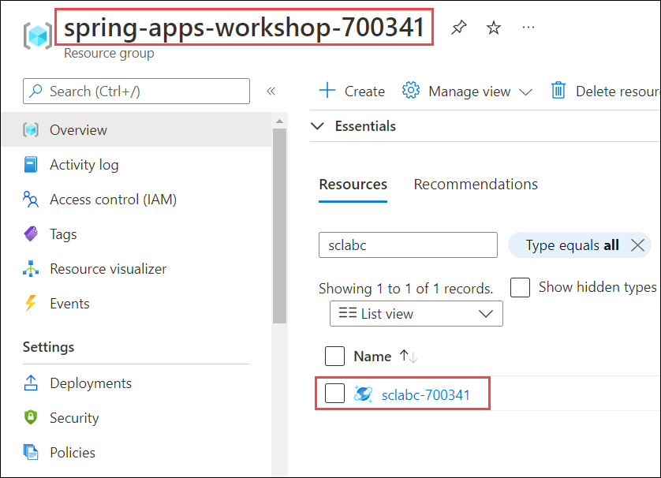
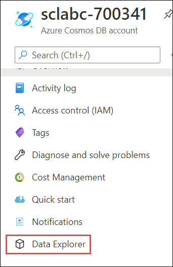
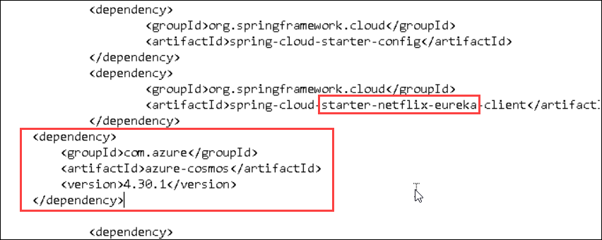
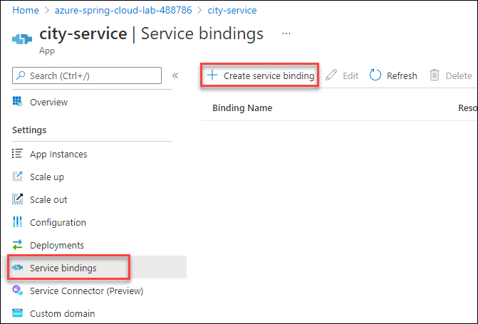

# Exercise 6 - Build a reactive Spring Boot microservice using Cosmos DB

In this section, we'll build an application that uses a [Cosmos DB database](https://docs.microsoft.com/en-us/azure/cosmos-db/?WT.mc_id=azurespringcloud-github-judubois) in order to access a globally-distributed database with optimum performance.

We'll use the reactive programming paradigm to build our microservice in this section, leveraging the [Spring reactive stack](https://docs.spring.io/spring/docs/current/spring-framework-reference/web-reactive.html). In contrast, we'll build a more traditional data-driven microservice in the next section.

---

## Task 1 : Prepare the Cosmos DB database

1. Navigate to your CosmosDB account named **sclabc-<inject key="DeploymentID" enableCopy="false"/>** in the resource group **spring-apps-workshop-<inject key="DeploymentID" enableCopy="false"/>**.

   

2. Click on the **Data Explorer** menu item

   

3. Expand the container named `azure-spring-cloud-cosmosdb`.

4. In that container, expand the container named `City`.

5. Click on "Items" and use the "New Item" button to create some sample items and **Save**:

    ```json
    {
        "name": "Paris, France"
    }
    ```

    ```json
    {
        "name": "London, UK"
    }
    ```

   

## Task 2 : Create a Spring Webflux microservice

1. Minimise the browser and navigate back to Git Bash.

2. To create our microservice, we will invoke the Spring Initalizer service from the command line:

```bash
curl https://start.spring.io/starter.tgz -d dependencies=webflux,cloud-eureka,cloud-config-client -d baseDir=city-service -d bootVersion=2.7.0 -d javaVersion=17 | tar -xzvf -
```
2. Navigate to the path `C:\Users\demouser\city-service` to find the city service folder 

   

> **Note**: We use the `Spring Webflux`, `Eureka Discovery Client` and the `Config Client` Spring Boot starters.

## Task 3 : Add the Cosmos DB API

1. Navigate to the path `C:\Users\demouser\city-service`, in the application's `pom.xml` file, add the Cosmos DB dependency just after the `spring-cloud-starter-netflix-eureka-client` dependency and Save.

   

```xml
        <dependency>
            <groupId>com.azure</groupId>
            <artifactId>azure-cosmos</artifactId>
            <version>4.30.1</version>
        </dependency>
```

## Task 4 : Add Spring reactive code to get the data from the database

1. Navigate to the path `C:\Users\demouser\city-service\src\main\java\com\example\demo`. Next to the `DemoApplication` class, create a `City.java` file:

```java
package com.example.demo;

class City {

    private String name;

    public String getName() {
        return name;
    }

    public void setName(String name) {
        this.name = name;
    }
}
```

2. Then, in the same location, create a new `CityController.java` file that
contains the code that will be used to query the database.

> The CityController class will get its Cosmos DB configuration from the Azure Spring Cloud service binding that we will configure later.

```java
package com.example.demo;

import com.azure.cosmos.CosmosAsyncContainer;
import com.azure.cosmos.CosmosClientBuilder;
import com.azure.cosmos.models.CosmosQueryRequestOptions;
import com.azure.cosmos.models.FeedResponse;

import org.springframework.beans.factory.annotation.Value;
import org.springframework.web.bind.annotation.GetMapping;
import org.springframework.web.bind.annotation.RestController;
import reactor.core.publisher.Flux;

import javax.annotation.PostConstruct;
import java.util.List;

@RestController
public class CityController {

    @Value("${azure.cosmosdb.uri}")
    private String cosmosDbUrl;

    @Value("${azure.cosmosdb.key}")
    private String cosmosDbKey;

    @Value("${azure.cosmosdb.database}")
    private String cosmosDbDatabase;

    private CosmosAsyncContainer container;

    @PostConstruct
    public void init() {
        container = new CosmosClientBuilder()
                .endpoint(cosmosDbUrl)
                .key(cosmosDbKey)
                .buildAsyncClient()
                .getDatabase(cosmosDbDatabase)
                .getContainer("City");
    }

    @GetMapping("/cities")
    public Flux<List<City>> getCities() {
        CosmosQueryRequestOptions options = new CosmosQueryRequestOptions();
        return container.queryItems("SELECT TOP 20 * FROM City c", options, City.class)
                .byPage()
                .map(FeedResponse::getResults);
    }
}
```

## Task 5 : Create the application on Azure Spring Cloud

1. As in exercise 2, create a specific `city-service` application in your Azure Spring Cloud instance by running the below command in Git Bash.

>Note: Replace the DID with **<inject key="DeploymentID" enableCopy="True"/>** value, you can also find it from Environment details page.

```bash
az spring app create -n city-service -s azure-spring-apps-lab-DID --runtime-version Java_17
```


## Task 6 : Bind the Cosmos DB database to the application

Azure Spring Cloud can automatically bind the Cosmos DB database we created to our microservice.

1. Navigate back to Azure Portal, From the resource group **spring-apps-workshop-<inject key="DeploymentID" enableCopy="false"/>** select the Azure Spring Cloud instance named **azure-spring-apps-lab-<inject key="DeploymentID" enableCopy="false"/>**.

2. Click on `Apps` under `settings`.

   

3. Select the `city-service` application

4. Go to `Service bindings` under `Settings` and click on `+ Create service binding`.

   

5. On `Create service binding` page, provide the following details.

  - Give your binding a name, for example `cosmosdb-city`
  - Select the available `Subscription` in the drop down list
  - Select the `Azure Cosmos DB` as the `Binding type` and `azure-spring-cloud-cosmosdb` for the Database name we created and keep the default `sql` API type
  - Select **sclabc-<inject key="DeploymentID" enableCopy="false"/>** as Resource name.
  - In the drop-down list, select the primary master key
  - Click on `Create` to create the database binding

   

## Task 7 : Deploy the application

1. Navigate to Git Bash and now you can build your **city-service** project and send it to Azure Spring Cloud

```bash
cd city-service
./mvnw clean package -DskipTests
az spring app deploy -n city-service -s azure-spring-apps-lab-DID --artifact-path target/demo-0.0.1-SNAPSHOT.jar
cd ..
```

 >Note: Replace the DID with **<inject key="DeploymentID" enableCopy="True"/>** value, you can also find it from Environment details page.

## Task 8 : Test the project in the cloud

1. Navigate back to Azure Portal, From the resource group **spring-apps-workshop-<inject key="DeploymentID" enableCopy="false"/>** select the Azure Spring Cloud instance named **azure-spring-apps-lab-<inject key="DeploymentID" enableCopy="false"/>**.

1. Select `Apps` under `Settings`.

2. Verify that `city-service` has a `Registration status` which says `1/1`. This shows that it is correctly registered in Spring Cloud Service Registry.

   

3. Select `city-service` to have more information on the microservice.

4. Click on **see more** under overview blade, if the Test endpoint is not visible and copy the **Test Endpoint** that is provided.

5. Append `/cities` at the end. Now you can now use CURL to test the `/cities` endpoint, and it should give you the list of cities you created. For example, if you only created `Paris, France` and `London, UK` like it is shown in this guide, you should get:

```json
[[{"name":"Paris, France"},{"name":"London, UK"}]]
```
---
