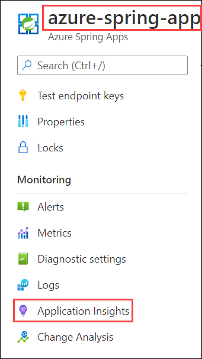
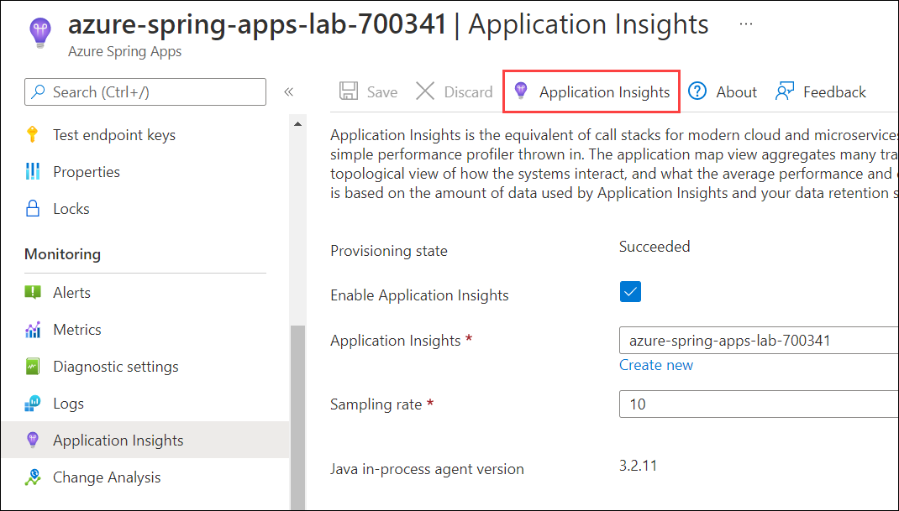
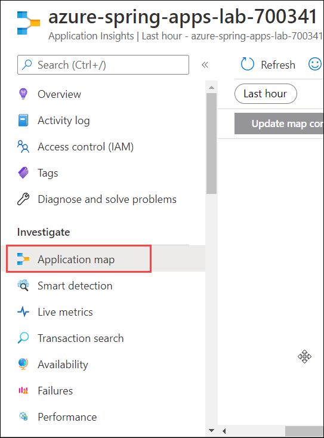

# Exercise 9 - Putting it all together, a complete microservice stack

Now that we have made two microservices publicly available, we will incorporate a user interface to see them in action. Then, we will use Azure Monitor to monitor the flow of traffic to and among our services and to track metrics.

---

## Task 1 : Add a front-end to the microservices stack

1. We now have a complete microservices stack:

- A gateway based on Spring Cloud Gateway.

- A reactive `city-service` microservice, that stores its data on Cosmos DB.
  
- A `weather-service` microservice, that stores its data on MySQL

2. In order to finish this architecture, we need to add a front-end to it:

- We've already built a VueJS application.

- This front-end could be hosted in Azure Spring Apps, using the same domain name (this won't be the case in this guide, and that's why we enabled CORS in our gateway earlier).
  
- If you are familiar with NodeJS and Vue CLI, you can run this application locally by typing `npm install && vue ui`.

3. In order to simplify this part, which is not relevant to understanding Spring Apps, we have already built a running front-end:

      ```https://spring-training.azureedge.net/```

4. Go to ```https://spring-training.azureedge.net/```, input your Spring Cloud Gateway's public URL (It should look like this ```https://azure-spring-apps-lab-DID-gateway.azuremicroservices.io```), in the text field and click on "Go". You should see the following screen:

   > **Note**: You can find the Spring Cloud Gateway's public URL in the **gateway** apps overview pane as **URL**

    

## Task 2 : Review the distributed tracing to better understand the architecture

1. We have already enabled distributed tracing on our Azure Spring Apps instance in exercise 1 by adding the `--enable-java-agent` flag to the create command.

2. Now, you can use the VueJS application on ```https://spring-training.azureedge.net/``` to generate some traffic on the microservices stack.

>💡 Tracing data can take a couple of minutes to be ingested by the system, so use this time to generate some load.

3. Navigate back to Azure Portal, From the resource group **spring-apps-workshop-<inject key="DeploymentID" enableCopy="false"/>**, select the Azure Spring Apps instance named **azure-spring-apps-lab-<inject key="DeploymentID" enableCopy="false"/>** and under monitoring select **Application Insights**

   

4. On the "Application Insights" pane, select **Application Insights** again. 

   

5. You are navigated to the **Application Insights** resource **azure-spring-apps-lab-<inject key="DeploymentID" enableCopy="false"/>**. Then click on **Application map** under **Investigate** to access the full application map, as well as a search engine that allows you to find performance bottlenecks.

   

> 💡 If your application map looks different from the one above, select the hierarchical view from the layout switch in the top-right corner:
>
> 

## Task 3 : Review the performance metrics

1. In the same page, click on **Performanace** under **Investigate** to view the operational performance of the resource.

   

2. On `Performance` blade you can see response times and request counts for operations exposed by your applications.

   

3. For even more detailed data, navigate to the `Dependencies` tab in the `Performance` blade where you can see all your dependencies and their response times and request counts.

## Task 4 : Scale applications

Now that distributed tracing is enabled, we can scale applications depending on our needs.

1. Go to the overview page of your Azure Spring Apps server and select **Apps** in the menu.

   
  
2. Select one service and click on **Scale Out** under **Settings**.  

   

5. Modify the number of instances to manually scale the service. You can also set custom auto scaling based on metrics. 

   

---
